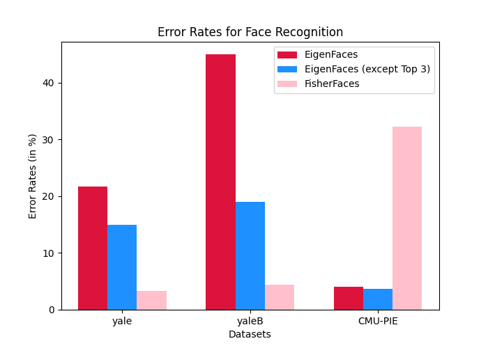

# FisherFaces-for-Face-Recognition

In this project, we studied, implemented and evaluated the methods described in [this](https://cseweb.ucsd.edu/classes/wi14/cse152-a/fisherface-pami97.pdf) paper for Face Recognition, particulary **FisherFaces** and its comparison with **Eigenfaces**. Fisherface method tackles various challenges faced in face recognitoin such as illumination variations or facial expressions. Used Yale, YaleB and CMU face image datasets for evaluation. Also, implemented Glass recognition on Yale dataset. 

## Running Instructions

All the code is present in `src` directory and some notebooks for plotting results and analyzing Yale dataset are in `notebooks` folder. For running the code, go inside `src` and run 
```
python3 main.py --dataset <dataset_name>
```
where `<dataset_name>` $\in$ `[yale, yaleB, cmu]`

It will run the 3 methods (eigenfaces, eigenfaces leaving top 3, fisherfaces) on the dataset provided as arguement and output the evaluation results. For yale dataset, it will also perform Glass recognition and display its results using leaving one out method

## Results



## Group Members
- Atishay Jain (210050026)
- Cheshta Damor (210050040)
- Kanad Shende (210050078)
